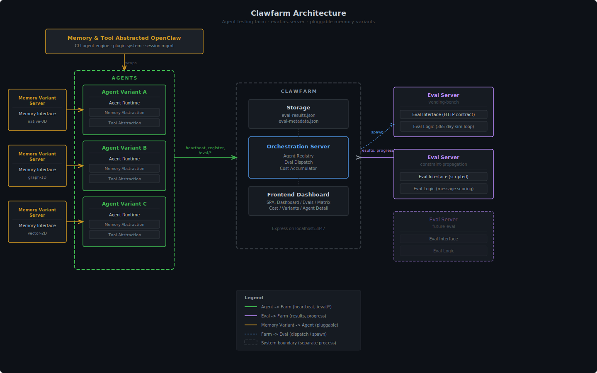

# Clawfarm Architecture

A testing farm for comparing agent memory system variants. Agents with different memory backends run standardized evals, and results are collected in a central dashboard.



## System Overview

Clawfarm has three main subsystems that run as separate processes:

| System | Location | Purpose |
|--------|----------|---------|
| **Farm** | `farm/` | Central dashboard + orchestration server (Express, port 3847) |
| **Agent-Base** | `agent-base/` | Agent runtime harness — wraps OpenClaw with pluggable memory backends |
| **Evals** | External repos (e.g. `vending-bench/`) | Standardized benchmarks that test agents via HTTP |

OpenClaw (the underlying agent engine) is a separate project that agent-base wraps with memory and tool abstractions. In the current design, OpenClaw exposes generic memory tools while Clawfarm variants remain the source of truth for memory storage, recall injection, and write policy.

## How It Works

### Eval-as-Server Architecture

Evals communicate with agents through an HTTP contract on agent-base:

```
Eval Process                          Agent-Base Process
    |                                       |
    |  POST /eval/configure                 |
    |  { pluginDir, tools, stateFile }      |
    |-------------------------------------->|  (load eval's plugin into openclaw)
    |                                       |
    |  POST /eval/message                   |
    |  { message: "Day 1 briefing..." }     |
    |-------------------------------------->|  (forward to openclaw agent)
    |  { text, toolCalls, tokenUsage }      |
    |<--------------------------------------|
    |                                       |
    |  POST /eval/reset                     |
    |-------------------------------------->|  (new session for next run)
    |                                       |
    |  GET /eval/agent-status               |
    |-------------------------------------->|  (readiness check)
    |                                       |
```

This keeps eval logic (simulation, scoring) cleanly separated from agent infrastructure (LLM calls, memory, tool execution).

### Agent Variants

Each agent variant runs the same OpenClaw engine but with a different memory backend:

- **native-0D**: Flat file storage (baseline)
- **three-layer-1d**: Three-layer file routing with LLM-driven consolidation
- **five-day-1d**: Boot-discipline memory with learnings, handover, and backend-owned recall
- **five-day-1d-cerebras-glm47**: Five-day memory plus Cerebras `zai-glm-4.7`

The memory backend is swappable via the `MemoryBackend` interface in agent-base. Each variant registers with the farm and reports heartbeats.
Backends now own their workspace composition and eval persona overlays rather than relying on generic root-file seeding outside the memory layer.
Backends also own prompt-time recall and in-turn memory storage through an HTTP bridge that OpenClaw's memory tools call into.
Agent-base is now provider-aware instead of Anthropic-only: it provisions auth and eval preflight checks from the configured model provider, and it passes eval-side supplier/search model settings into external eval subprocesses.

### Farm Dashboard

The farm server (`farm/src/server.ts`) provides:

- **Agent Registry**: Track which agents are online, their memory variants, and health status
- **Eval Dispatch**: Start evals against specific agents (via `EvalBridge`)
- **Results Storage**: Persist eval transcripts, scores, and cost data
- **Frontend SPA**: Visual dashboard for comparing variants across evals

### Eval Bridge

When the farm dispatches an eval, `EvalBridge` in agent-base:

1. Configures the chat handler with the eval's plugin (tools, state file path)
2. Spawns the eval subprocess with `--agent-url` pointing back to agent-base
3. Monitors progress (stdout parsing, exit code)
4. Reads the transcript JSON on completion and reports results to the farm

## Directory Structure

```
~/claude-projects/
  clawfarm/                    (this repo)
    package.json               (workspace root: ["farm", "agent-base"])
    start.sh                   (launch dashboard + agents)
    scripts/run-eval.sh        (run an eval against an agent)
    farm/                      (dashboard package)
      src/
        server.ts              (Express, port 3847)
        routes/api.ts
        eval-store.ts
        public/                (SPA frontend)
      test/
      data/                    (eval-results.json, eval-metadata.json)
    agent-base/                (agent harness package)
      src/
        lifecycle/
          agent-process.ts     (HTTP server + /eval/* endpoints)
          chat-handler.ts      (openclaw CLI wrapper + eval plugin support)
          eval-bridge.ts       (spawn eval subprocess, monitor, collect results)
          eval-runner.ts       (scripted evals)
        evals/
          vending-bench.ts     (eval definition: args, paths, agentMode)
          registry.ts
        memory/
          backend-memory-store.ts
          memory-backend-bridge.ts
          memory-backend.ts    (shared backend interface)
          backend-factory.ts   (variant selection)
          variants/            (native/, three-layer/, five-day/)
        monitoring/            (heartbeat, cost tracking)
      test/

  vending-bench/               (separate repo — an eval)
    src/
      index.ts                 (CLI: --mode direct|agent|openclaw)
      runner.ts                (direct mode — in-process LLM)
      agent-runner.ts          (agent mode — HTTP day loop)
      state-bridge.ts          (JSON state file for plugin <-> runner communication)
      plugin/                  (openclaw plugin: tool definitions for the sim)
      simulation/              (world state, demand model, events, scoring)
      tools/                   (direct-mode tool implementations)
      llm/                     (provider-aware Anthropic/Cerebras client)
    test/

  openclaw/                    (separate repo — the agent engine)
```

## Running

### Quick Start

```bash
# Start the farm dashboard
cd clawfarm && ./start.sh

# In another terminal, start an agent
cd clawfarm/agent-base && npx tsx src/runner.ts --config configs/example.json

# Run an eval against it
cd vending-bench && npx tsx src/index.ts run --mode agent --agent-url http://localhost:3900 --days 20
```

### Full Eval via Farm

```bash
# The farm can dispatch evals to registered agents
./scripts/run-eval.sh agent-01 vending-bench --days 365
```

## HTTP Endpoints

### Agent-Base (default port 3900)

| Endpoint | Method | Purpose |
|----------|--------|---------|
| `/chat` | POST | Send a message to the agent (live conversation) |
| `/eval/configure` | POST | Configure agent with eval's plugin and tools |
| `/eval/message` | POST | Send eval message, get agent response |
| `/eval/reset` | POST | Reset agent session for new eval run |
| `/eval/agent-status` | GET | Check if agent is ready |
| `/eval/start` | POST | Start an eval (dispatched by farm) |
| `/eval/status` | GET | Check running eval status |

### Farm Dashboard (port 3847)

| Endpoint | Method | Purpose |
|----------|--------|---------|
| `/api/agents` | GET | List registered agents |
| `/api/agents/:id/heartbeat` | POST | Agent heartbeat |
| `/api/evals` | GET | List eval results |
| `/api/evals/:id` | GET | Get eval detail |
| `/api/evals/start` | POST | Dispatch eval to agent |

## Testing

```bash
# All tests (from clawfarm root)
npm test

# Individual packages
npm run test:farm      # 23 tests
npm run test:agent     # 95 tests

# Vending-bench (separate repo)
cd ../vending-bench && npx vitest run   # 112 tests
```

Recent live checks:

- `five-day-1d-cerebras-glm47` completed a real 1-day `vending-bench` agent-mode run.
